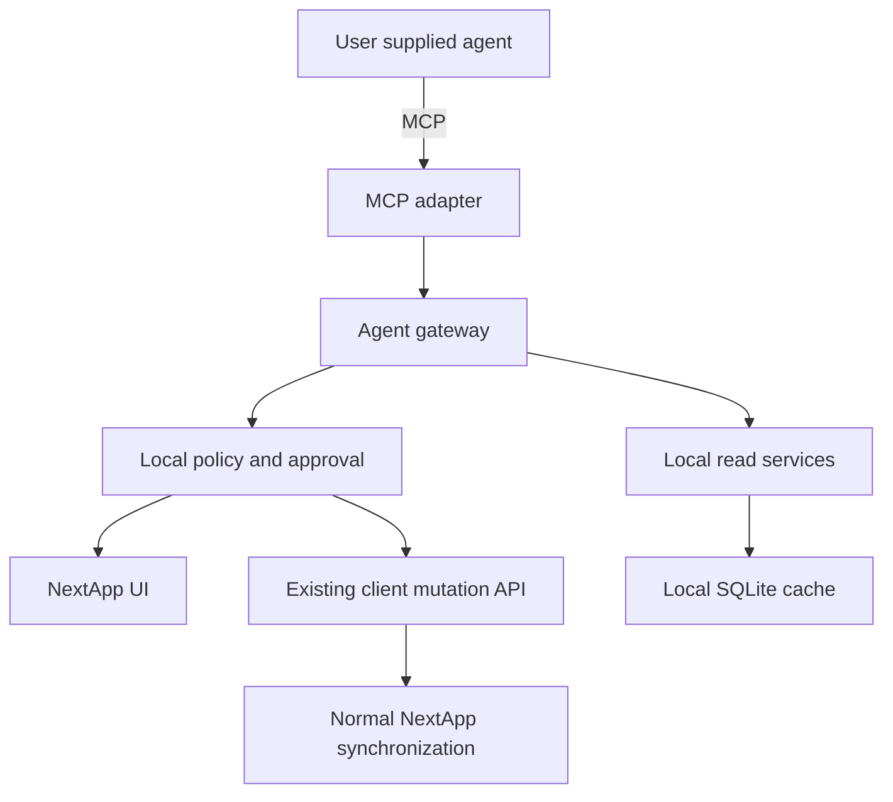
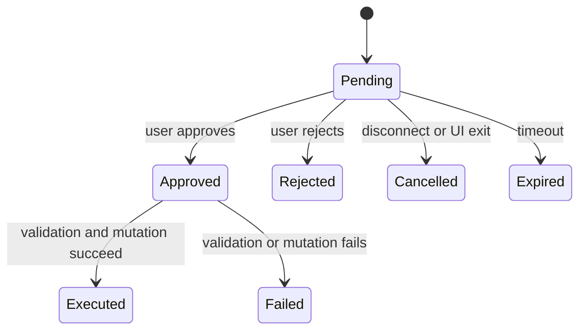
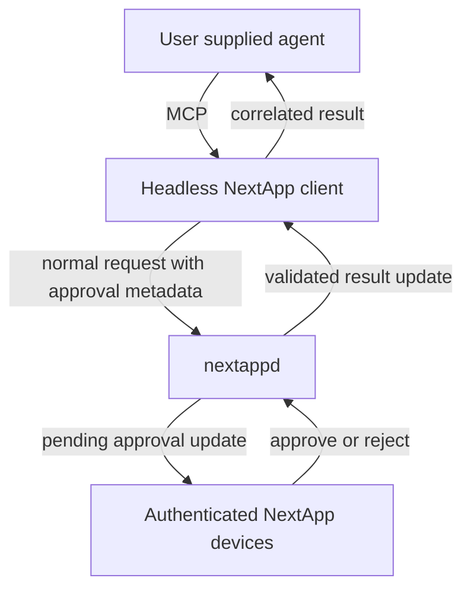
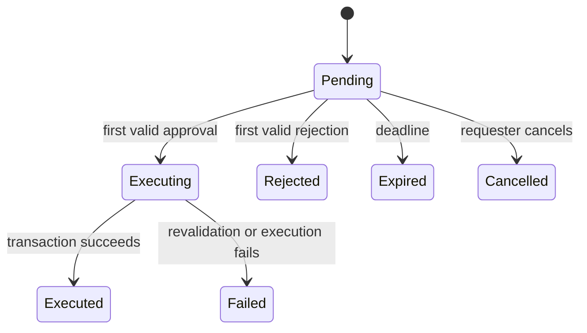

# NextApp Agent Support Two Phase Design

## Status

Proposed design for experimentation and later production implementation.

## Motivation

NextApp should allow users to bring their own agent and language model. The agent may use a local model, a remote model, or no language model at all. NextApp provides structured context and operations; it does not provide or manage the agent's reasoning loop.

The immediate goal is to get a useful implementation running quickly so the design can be tested with real agents before committing to the complete distributed architecture. The first phase therefore supports one local NextApp UI instance per agent and asks for confirmation in that UI. The second phase adds durable server-side approvals, approval from any active device, and a scaled-down headless NextApp client suitable for containers.

The final architectural rule is:

> Agents are NextApp clients, not privileged backend actors.

Agents must never receive direct database access, unrestricted query access, or a special path to expensive server operations. Reads primarily use locally synchronized state. Mutations use the same validated client operations and normal synchronization path as interactive changes.

## Goals

- Let users connect an agent through MCP or another adapter with equivalent semantics.
- Support local and remote language models without coupling NextApp to a model vendor or runtime.
- Expose useful, bounded, semantic operations rather than database primitives.
- Let an agent propose and perform operations without trusting its prompts, model, or external inputs.
- Require deterministic authorization outside the model.
- Preserve provenance and an audit trail for agent requests and decisions.
- Keep server cost bounded by making ordinary reads local.
- Allow the prototype to evolve into the full implementation without changing the fundamental agent-facing concepts.

## Non Goals

- Building an agent framework or reasoning loop into NextApp.
- Giving an agent SQL access or arbitrary backend query facilities.
- Sending credentials for integrations through an LLM.
- Uploading prompts, chain-of-thought, or full agent conversations to nextappd.
- Supporting unattended consequential operations in phase 1.
- Implementing general distributed approvals in phase 1.
- Guaranteeing that the phase 1 persistence format is compatible with phase 2.

## Common Security Model

Every agent must be treated as potentially compromised. This includes local agents: their model may process hostile email, calendar entries, issue descriptions, documents, or other prompt-injection content.

Security must therefore depend on:

- a distinct agent identity;
- explicitly granted capabilities;
- validation of each concrete operation and its arguments;
- human approval where required;
- bounded queries and responses;
- idempotent mutations;
- audit and provenance;
- the existing NextApp validation and synchronization path.

Advertising an MCP tool does not authorize every possible invocation of that tool. Authorization occurs after NextApp has received and validated the concrete arguments.

## Shared Agent Interface

The two phases should expose the same broad categories of agent operations, although phase 1 may implement only a subset.

### Read operations

Examples include:

- `get_inbox`
- `get_today`
- `get_list`
- `get_get_list_actions`
- `get_action`
- `search_actions`
- `get_recent_changes`

Reads must use semantic APIs with pagination, result limits, response-size limits, timeouts, and concurrency limits. MCP must not expose SQL or arbitrary server filters.

### Suggestion operations

Examples include:

- `suggest_action`
- `suggest_update`
- `suggest_completion`

A suggestion is not an action mutation. It is a first-class proposal that the user can accept, modify, reject, or ignore. Suggestions are the safest way to make untrusted experimental agents useful.

### Mutation operations

The initial useful set is:

- `create_action`
- `update_action`
- `complete_action`

Deletion, project-wide changes, bulk operations, and external side effects are excluded from phase 1 and should be added cautiously in phase 2 or later.

Every mutating request includes an agent-generated idempotency key. Repeating a request with the same agent identity and idempotency key must not create a second mutation.

**Important**
In phase 1 when the data is local, care must be taken to not lose the known keys when the database is refreshed from the server (database replaced). Maybe copy the affected table from the current database to the new database before the new database is renamed and used.

### Agent identity and capabilities

Each configured agent has:

- a stable identifier;
- a user-facing name;
- an installation or client identity;
- granted read, suggestion, and mutation capabilities;
- optional scope restrictions, such as selected projects;
- enabled or disabled state.

An agent's stated name, reason, and explanation are untrusted text. NextApp controls the rendering of the operation type, target, changed fields, and approval controls.

# Phase 1 Local Experimental Implementation

## Purpose

Phase 1 exists to learn how real agents use NextApp. It should be small enough to implement and revise quickly. It does not need to solve offline approval, cross-device approval, headless operation, or durable server coordination.

The expected deployment is one agent connected to one running NextApp UI instance. Multiple agents may be configured eventually, but each agent connection is owned by one UI instance and all confirmations for that connection appear there.

## Architecture

The MCP adapter and agent gateway run inside the desktop NextApp process.

The gateway must depend on abstract read, mutation, audit, and approval interfaces so it can later be reused by the headless client.

## Transport

Phase 1 should support the simplest MCP transport compatible with the selected MCP SDK and target agents. Prefer a local-only transport with no listening network socket, such as child-process standard input and output, if it fits the chosen MCP integration model.

If a local TCP or HTTP transport is required:

- bind only to loopback by default;
- require an unguessable per-agent credential;
- never expose the endpoint on all interfaces by default;
- place strict request and connection limits on it;
- clearly show when the endpoint is enabled.

## Implementation details

Requests should use existing internal methods when possible.

All requests must use async coroutines via QCoro.

## Reads

All phase 1 reads operate on the local SQLite cache or existing in-memory client models. An MCP read must not trigger a new unbounded backend query. If synchronized state is incomplete, the response should report that fact rather than bypassing the client architecture.

Minimum limits must include:

- maximum page size;
- maximum serialized response size;
- maximum concurrent calls per agent;
- query deadline;
- rate limit;
- maximum search length and complexity.

Read responses should include stable UUIDs and enough revision or modification information for an agent to avoid acting on stale assumptions.

## Local confirmation flow

For phase 1, every actual mutation requires local confirmation unless it is explicitly classified as harmless during implementation. Suggestions do not require confirmation because they remain proposals.

1. The MCP adapter receives a structured tool invocation.
2. The gateway authenticates the configured agent and checks its capability.
3. NextApp performs structural and cheap semantic validation.
4. The gateway constructs an immutable local pending operation.
5. QML displays a confirmation generated from the structured operation.
6. The user approves or rejects it in the same running UI.
7. On approval, the gateway revalidates the operation against current local state.
8. The existing client mutation API performs the change and normal synchronization.
9. The result is returned to the MCP caller and written to the local audit log.

The dialog must show:

- agent name;
- operation type;
- target object and current user-visible name;
- exact proposed field changes;
- agent-supplied reason, clearly identified as untrusted explanatory text;
- Approve and Reject actions.

The dialog must not render arbitrary rich text, remote images, active links, or agent-supplied UI markup.

## Waiting behavior

Phase 1 may keep the MCP tool call open while the confirmation dialog is pending, subject to a short configurable timeout. This is intentionally a prototype simplification.

If the UI closes, the agent disconnects, or the timeout expires, the operation is cancelled and is not executed. Pending requests do not survive a client restart in phase 1.

The internal request object should nevertheless have a UUID, timestamps, operation type, target, arguments, idempotency key, agent identity, and state. This provides useful experience for the phase 2 data model.

## Phase 1 state model

Only `Pending` may receive a user decision. Resolution must be atomic within the client so repeated clicks or duplicate MCP calls cannot execute the operation twice.

## Local audit and provenance

Phase 1 records locally:

- request ID and idempotency key;
- agent identity;
- operation type and normalized arguments;
- target UUID;
- creation and resolution times;
- approval decision;
- executing user and device identity where available;
- result or error;
- resulting object UUID and revision where available.

Do not record prompts, hidden reasoning, credentials, or unrelated model context.

Where practical, objects created or changed by an agent should retain lightweight provenance that can later be shown as “Created through Planning Agent.” Full server-visible provenance is a phase 2 concern.

## Phase 1 UI

The minimum UI consists of:

- a toggle in global settings to "Enable AI", default off. If off, no other AI related UI elements are visible and all AI features disabled (including the MCP HTTP listener, even if it was configured).
- an Agent settings page for enabling the local MCP interface and managing one agent identity;
- a confirmation dialog or queue;
- a Suggestions view or integration with an existing inbox;
- a small local activity history suitable for debugging.
- a suitable icon close to the online icon on the main screen showing agent activity trough color/animation

The UI should make it easy to disable agent access immediately.

## Phase 1 implementation boundaries

To keep the experiment fast, phase 1 deliberately omits:

- server protocol changes for approvals;
- approval from another device;
- persisted pending operations across restarts;
- headless or container execution;
- broad autonomous permissions;
- agent access to external-service credentials;
- bulk and destructive operations;
- a complete long-term policy language.

However, phase 1 must not bypass the existing mutation API, write directly to SQLite, expose arbitrary queries, or place approval logic directly in QML. Those shortcuts would invalidate the experiment and make migration harder.

## Phase 1 success criteria

Phase 1 is successful when it can answer these questions with real use:

- Which NextApp resources and tools do agents actually need?
- Are the tool schemas understandable to both small local models and hosted agents?
- Is a suggestion object useful, or do users prefer confirmed direct changes?
- Which operations become annoying when confirmed every time?
- What information makes confirmation dialogs understandable and safe?
- What query and response limits work without making agents ineffective?
- How often do agents retry or duplicate requests?
- What audit information is useful in practice?

Phase 1 remains behind a CMAKE option for MCP and a CMAKE option for AI in general, both enabled by default.

# Phase 2 Full Distributed Implementation

## Purpose

Phase 2 turns local confirmation into a general, durable NextApp approval mechanism. It supports headless agent clients, approvals from any authenticated active device, recovery after disconnection or server restart, and delayed delivery to devices and agents that reconnect later.

The mechanism should be general enough for future non-agent approvals, but agent requests are its first use case.

## Architecture

The headless client contains a scaled-down form of the ordinary NextApp client:

- authentication and device identity;
- synchronization protocol;
- local SQLite cache;
- shared domain models and validation helpers;
- agent gateway and MCP adapter;
- policy and resource limits;
- no QML or interactive desktop dependencies.

The container runs in the user's infrastructure. It pays the compute cost of agent reads and model use. nextappd sees bounded normal synchronization traffic plus the approval lifecycle.

## Deferred transactional updates

An approval request is an ordinary mutation request plus approval metadata. If approval is required, nextappd validates what it can immediately, stores the exact immutable request, and does not execute it yet.

Approval authorizes nextappd to attempt that stored operation against current authoritative state. It does not authorize the client to submit a later modified operation.

This avoids a request-approval-request substitution problem and gives the system durable asynchronous semantics.

## Submission validation

Before persisting a pending request, nextappd rejects requests with:

- invalid or oversized protocol data;
- unknown operations;
- invalid authentication or device identity;
- missing agent/request identity;
- capabilities that do not allow requesting the operation;
- malformed identifiers or impossible static arguments;
- expired request timestamps;
- duplicate idempotency keys with conflicting payloads;
- requests exceeding tenant, device, or agent limits.

State-dependent validation that can change while approval is pending is repeated at execution time.

## Suggested pending request model

The exact protobuf and database schema should follow established NextApp conventions, but the logical record needs:

| Field | Purpose |
| --- | --- |
| Request ID | Stable correlation identifier |
| Tenant and user | Ownership and authorization scope |
| Requesting device | Headless or interactive client identity |
| Agent identity | User-visible agent provenance |
| Idempotency key | Duplicate suppression |
| Operation type | Semantic mutation being requested |
| Immutable payload | Exact normal request to execute |
| Normalized summary | Server-generated approval presentation data |
| Agent reason | Optional untrusted explanation |
| Created and expiry times | Lifecycle and cleanup |
| State | Pending, executing, or terminal state |
| Resolution identity | User and device that decided |
| Resolution and execution times | Audit and ordering |
| Result or error | Durable outcome for reconnecting clients |
| Resulting revision | Correlation with synchronized state |

The immutable payload and all security-relevant metadata must be protected against modification after submission.

## Distributed lifecycle

The transition out of `Pending` must be transactional. If two devices answer concurrently, the first valid transition wins. All other devices receive the resolved state and remove the pending prompt.

`Executing` prevents duplicate execution after a race or retry. Recovery logic must safely resume or resolve requests left in that state after a server restart. Prefer executing the state transition and mutation within one database transaction where the affected operation permits it. Where that is impossible, the implementation must define idempotent recovery semantics before enabling the operation.

## Execution after approval

After approval, nextappd loads the stored request and revalidates it against current database state using the same authoritative validation path as an immediate normal update.

Approval means “attempt this exact operation now,” not “force this outcome.” The operation may fail because the target was deleted, completed, moved, changed, or no longer satisfies a precondition.

An approved request must not bypass normal business rules, authorization, optimistic concurrency checks, or tenant isolation.

## Replication and delivery

Pending approvals and retained terminal results are synchronized state, not transient notifications.

nextappd sends:

- a pending-request-added update to eligible active sessions;
- all still-pending requests during initial synchronization or reconnection;
- a pending-request-resolved update to all relevant sessions;
- durable terminal results to the requesting client when it reconnects.

The existing ordered update and resynchronization mechanisms should be used where possible. Delivery must not depend on an RPC remaining open.

The requesting MCP operation becomes asynchronous in phase 2. It returns a stable NextApp request ID and an initial status. The agent can receive completion through the MCP mechanism selected during implementation or poll a bounded `get_request_status` tool. The design must not assume that a specific agent remains connected for the lifetime of the request.

## Approval UI

Any authenticated eligible NextApp device may show a pending approval. The UI is built from normalized structured data, not from agent-generated markup.

The approval view shows:

- requesting agent and device;
- operation and affected object;
- current object state where relevant;
- exact proposed changes;
- creation and expiry times;
- optional agent-supplied reason;
- Approve and Reject actions.

The UI must refresh or clearly identify stale displayed state before a decision. Server-side revalidation remains mandatory even if the UI refreshes.

Android and desktop may use notifications to announce a request, but the decision must occur in authenticated NextApp UI. Notification actions should only be used if they can provide equivalent authenticated, deliberate confirmation without leaking sensitive details on the lock screen.

## Eligibility and policy

Initially, any active authenticated device for the same user may decide a request. Tenant and role rules must be checked server-side.

Future policy may support rules such as “this agent may complete actions in project X without confirmation,” but phase 2 should begin with explicit approval for consequential operations. “Always allow” must not be added until its scope and revocation semantics are precise and visible.

The server, not the requesting agent, decides whether approval is required. A client may conservatively request approval, but it cannot mark a server-required operation as pre-approved.

## Cancellation, expiry, and retention

- The requesting client may cancel only a still-pending request it owns.
- Every request has a server-enforced expiry.
- Expired requests are never executable and produce a terminal result.
- Terminal records are retained long enough for offline requesters and audit views to receive the result.
- Payload retention should be minimized after the audit and recovery period, subject to operational and legal needs.
- Cleanup must be bounded and indexed so approvals cannot become a storage denial-of-service vector.

## Resource controls

Both nextappd and the headless client need limits for:

- pending requests per tenant, user, device, and agent;
- request payload and reason size;
- request creation rate;
- terminal-result retention;
- MCP concurrency and rate;
- local query time and response size;
- synchronization backlog size;
- cancellation and status polling rate.

No approval payload may contain arbitrary executable code or opaque operations unknown to nextappd.

## Audit and provenance

The server records approval lifecycle facts:

- who and which device requested the operation;
- agent identity;
- what exact normalized operation was stored;
- when it was created and expired;
- who and which device approved, rejected, or cancelled it;
- execution result and resulting revision.

The system does not upload model prompts, chain-of-thought, credentials, or unrelated context.

Agent provenance should become part of the durable history for mutations so clients can show who or what initiated a change and why it appeared.

## Headless container client

The container image should:

- run without Qt GUI or QML dependencies where practical;
- persist its SQLite cache and device identity on a mounted volume;
- keep NextApp credentials in an appropriate secret store or mounted secret;
- expose MCP only on explicitly configured interfaces;
- support TLS and authentication for non-local MCP transports;
- publish health and bounded operational metrics without leaking task data;
- recover synchronization, pending request status, and terminal results after restart;
- use the same agent gateway and domain operations as the desktop client.

Container deletion must not leave the associated device or agent credential permanently active without a clear revocation path in NextApp.

# Migration From Phase 1 to Phase 2

## Components to preserve

Phase 1 should deliberately produce reusable components:

- semantic MCP resource and tool schemas;
- agent identity and capability representation;
- agent gateway;
- bounded local query services;
- immutable operation description;
- approval-service interface;
- audit-event representation;
- idempotency behavior;
- use of existing client mutation APIs.

The local approval implementation is replaced by a distributed approval implementation behind the same conceptual interface.

## Components expected to change

The following phase 1 behavior is temporary:

- keeping the MCP call open;
- local-only pending request storage;
- cancellation when the UI exits;
- one UI owning the decision;
- local-only audit history;
- experimental transport and configuration UI.

No compatibility guarantee is needed for phase 1 pending requests or local audit data. The stable investment is the semantic interface and shared client-domain code.

## Recommended delivery sequence

1. Implement the phase 1 read-only MCP surface with strict limits.
2. Add first-class suggestions.
3. Add one confirmed mutation, preferably `create_action`.
4. Add `update_action` and `complete_action` after the approval UI and idempotency behavior are proven.
5. Use the prototype long enough to revise tool schemas based on real agents.
6. Extract reusable client-domain and agent-gateway code from GUI-specific code.
7. Add server-side pending-request persistence and distributed updates.
8. Move consequential mutation execution to the deferred server workflow.
9. Build the headless client and container image from the shared core.
10. Add broader permissions and integrations only after the audit and policy model is proven.

# Acceptance Criteria

## Phase 1

- A user can explicitly enable one local agent connection.
- The agent can read bounded synchronized NextApp state without causing arbitrary backend queries.
- The agent can create suggestions.
- Supported mutations display a local structured confirmation before execution.
- Approved mutations use the existing client mutation and synchronization path.
- Rejected, expired, duplicated, and disconnected requests do not execute.
- Activity is recorded locally without storing model secrets or hidden reasoning.
- Agent access can be disabled and its credential revoked.

## Phase 2

- A headless container client can synchronize its local cache and expose the shared MCP interface.
- A mutation requiring approval is persisted exactly once as an immutable pending request.
- Eligible active devices receive it, and newly connected devices receive it while it remains pending.
- The first valid decision wins atomically and is broadcast to other sessions.
- Approval triggers authoritative revalidation and at-most-once logical execution.
- Rejection, cancellation, expiry, validation failure, and success all produce durable correlated results.
- Server and client restarts and temporary network loss do not lose pending requests or retained results.
- No agent receives direct database access, unrestricted server queries, or integration credentials through the model.

# Open Questions To Resolve During Phase 1

- Which MCP transport and SDK are practical across Linux, Windows, macOS, and later the headless container?
- Should suggestions be synchronized immediately or remain local until accepted in the prototype?
- What compact context shape works well for small local models?
- Which revision or precondition fields should mutation tools expose?
- How should long-running MCP requests and cancellation be represented by target agent clients?
- Which operations are safe enough to permit without confirmation later?
- How should agent identities and credentials be created, displayed, rotated, and revoked?
- Which audit details belong in normal object history versus a separate agent activity view?

These questions are reasons to build phase 1; they should not delay the local experiment unless they affect its security boundary.
